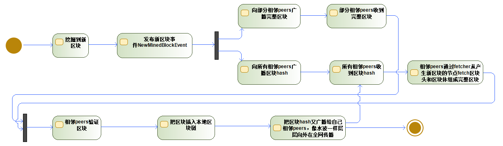
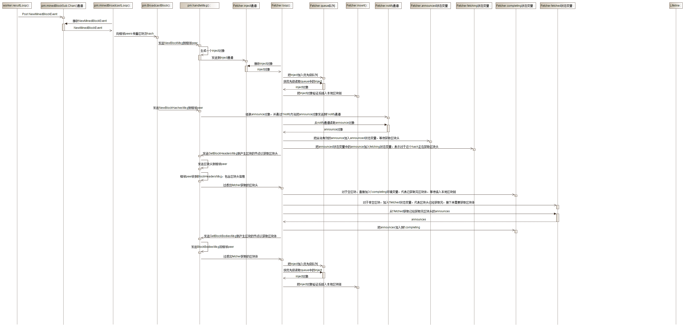
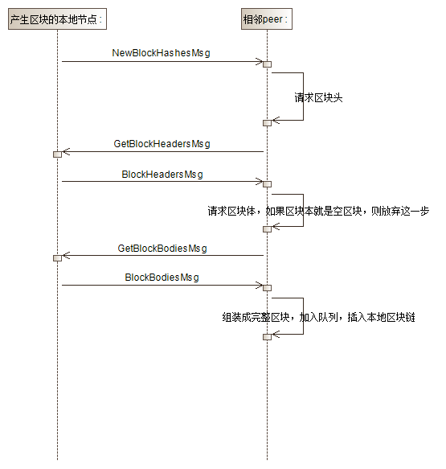
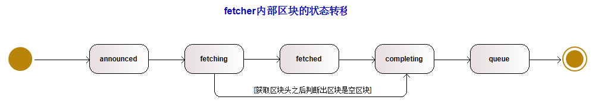

# 一个区块的完整生命周期流程

本篇博客会详细剖析一个区块从被挖掘、被广播到相邻peers、被相邻peers加入到本地区块链、直至传播到全网所有peers的完整过程，也就是一个区块的完整生命周期流程。

## 总体流程

区块的完整生命周期涉及到多个模块，如果直接深入细节，会让人陷入和迷失在细节中，不能一窥全貌，所以先梳理一下总的流程，把全貌搞清楚。

总体流程图(activity diagram)如下



这个流程图就从整体宏观的层面勾画了一个区块从产生到传播的完整生命周期。用最宏观的话讲，就是一个peer挖掘了一个区块，就把这个新区块的消息，广播通知给所有相邻的peers；相邻peers收到区块消息后，进行简单的验证，验证如果没有问题，且这个区块的number正好是本地区块链期望的下一个区块的number，那么就交给blockChain做完整的验证，这个过程会执行区块中所有的交易，验证没有问题之后把区块加入到本地区块链，写入数据库。

总体流程图中有两个分支，这是因为本地节点传播新区块有两种不同的策略：

1. 向sqrt(N)个相邻peers传播完整区块
2. 向所有相邻peers传播区块hash

相邻peers收到完整区块后（或者收到区块hash然后获取完整区块后），又会把区块hash传播给自己相邻的peers。打个比方，A是产生区块的节点，把区块传播给节点B，节点B把区块插入到本地区块链之后，又会把区块传播给节点B的相邻节点C，像水波一样，不断地在全网扩散这个区块。

通过流程图可以从最顶层的角度了解整个生命周期，但要深入了解的话，需要深入细节。下面这个时序图（sequence diagram）从更加微观的角度呈现了一个区块的生命周期



这个时序图涉及到了代码层面，一是看不懂不要紧，先大概瞄一眼，然后继续看下面的源码解析，看完源码解析之后再回来看这个时序图就理解了。

## 源码解析

接下来就从代码的层面来看一看一个区块的完整生命周期。

注：所有的细节代码解析都通过中文注释的形式体现在代码片段中。

### 本地节点挖掘、产生、广播新区块

当本地节点挖掘到一个区块后，会在worker.resultLoop()方法中发布一个NewMinedBlockEvent事件。

```go
func (w *worker) resultLoop() {
	for {
		select {
		case block := <-w.resultCh:
			// ......省略

			// Broadcast the block and announce chain insertion event
			// 广播区块并宣布链插入事件
			// Post向所有注册了给定type的接收者发送一个事件。如果mux已经停止，它将返回ErrMuxClosed。不过此处并没有处理返回的ErrMuxClosed，需要优化。
			w.mux.Post(core.NewMinedBlockEvent{Block: block})
			
			// ......省略
		case <-w.exitCh:
			return
		}
	}
}
```

ProtocolManager.minedBroadcastLoop()是NewMinedBlockEvent事件处理方法。本地节点订阅NewMinedBlockEvent事件的goroutine收到事件后，就会把这个新挖掘区块的消息，广播给它所有的相邻peers。

```go
// Mined broadcast loop
// 挖矿广播循环
func (pm *ProtocolManager) minedBroadcastLoop() {
	// automatically stops if unsubscribe
	// 取消订阅时自动停止。
	// for-range语法用到通道上时，循环会一直接收通道里的数据，直到通道关闭
	for obj := range pm.minedBlockSub.Chan() {
		if ev, ok := obj.Data.(core.NewMinedBlockEvent); ok {
			// 把新区块广播到部分相邻peers。如果节点连接了N个相邻peers，则只向sqrt(N)个peers广播完整的区块消息。
			pm.BroadcastBlock(ev.Block, true)  // First propagate block to peers
			// 把只包含新区块Hash的消息广播到所有相邻peers，相邻peers通过fetcher获取完整区块（区块头和区块体）
			pm.BroadcastBlock(ev.Block, false) // Only then announce to the rest
		}
	}
}
```

这里调用了两次pm.BroadcastBlock()：

1. 当propagate为true时，把完整区块广播给部分相邻peers
2. 当propagate为false时，把区块hash信息广播给所有相邻peers

### 相邻peer处理新区块

#### 相邻peer处理完整的区块消息NewBlockMsg

NewBlockMsg处理的入口是ProtocolManager.handleMsg，这里包含两种消息的处理：

1. NewBlockMsg：完整区块消息。由于收到的已经是完整的区块，不需要再从区块产生节点获取完整区块，所以处理流程比较简洁，把完整区块链插入本地区块链即可，请参考时序图。
2. NewBlockHashesMsg：区块hash信息。处理流程比完整区块的处理流程复杂一些，前面要多一些步骤，主要是去区块产生节点获取区块头和区块体信息，然后再组装成完整区块，剩下的逻辑就和NewBlockMsg的处理逻辑一致了，把完整区块插入本地区块链。

完整区块的处理流程如下：

1. 对消息进行RLP解码，标记发送消息的peer已经拥有这个区块，这样做的原因是最后这个节点完成区块插入之后，会将区块hash再广播给自己的相邻peers，这时就不用再发送给该peer
2. 将这个新区块加入到fetcher.queue队列，等待插入本地区块链。
3. 更新peer的head位置，如果发送消息的peer的总难度大于本地区块链的总难度，那么说明本地区块链已经落后于发送消息的peer，那么尝试将本地区块链与发送消息的peer同步。

```go
// handleMsg is invoked whenever an inbound message is received from a remote
// peer. The remote connection is torn down upon returning any error.
// 当从一个远程peer接收到一个inbound消息，都会调用handleMsg。当有任何错误返回时，远程连接将被断开。
func (pm *ProtocolManager) handleMsg(p *peer) error {
	// Read the next message from the remote peer, and ensure it's fully consumed
	// 从远程peer读取下一条消息，并确保它被完全消费
	msg, err := p.rw.ReadMsg()
	if err != nil {
		return err
	}
	// 协议消息大小的最大上限，目前不能超过10Mbytes
	if msg.Size > protocolMaxMsgSize {
		return errResp(ErrMsgTooLarge, "%v > %v", msg.Size, protocolMaxMsgSize)
	}
	// Discard将剩余的payload数据读入一个黑洞。
	defer msg.Discard()

	// Handle the message depending on its contents
	// 根据消息的内容处理消息
	switch {
	// ......省略
	
	case msg.Code == NewBlockMsg:
		// Retrieve and decode the propagated block
		// 收到并解码传播过来的新区块，解码为newBlockData。newBlockData是用于区块传播消息的网络包
		var request newBlockData
		// Decode将一条消息的RLP内容解析为给定的值，该值必须是一个指针。
		if err := msg.Decode(&request); err != nil {
			return errResp(ErrDecode, "%v: %v", msg, err)
		}
		// sanityCheck验证值是否合理，作为一个DoS保护。具体验证逻辑还没细看。
		if err := request.sanityCheck(); err != nil {
			return err
		}
		request.Block.ReceivedAt = msg.ReceivedAt
		request.Block.ReceivedFrom = p

		// Mark the peer as owning the block and schedule it for import
		// 将peer标记为拥有该区块，并schedule它的导入。MarkBlock标记一个peer已知一个区块，确保该区块永远不会被传播到这个特定的peer。
		p.MarkBlock(request.Block.Hash())
		// 将新收到的区块通过Fetcher.Enqueue方法通知Fetcher对象，也就是把新区块存入Fetcher的优先级队列。Enqueue会根据新区块生成一个inject对象，然后发送到inject通道。
		pm.fetcher.Enqueue(p.id, request.Block)

		// Assuming the block is importable by the peer, but possibly not yet done so,
		// calculate the head hash and TD that the peer truly must have.
		// 计算截止到接收到的新区块的parent区块的头哈希和总难度.
		var (
			trueHead = request.Block.ParentHash()
			trueTD   = new(big.Int).Sub(request.TD, request.Block.Difficulty())
		)
		// Update the peer's total difficulty if better than the previous
		// 如果比以前的总难度大，则更新peer的总难度和head哈希
		if _, td := p.Head(); trueTD.Cmp(td) > 0 {
			p.SetHead(trueHead, trueTD)

			// Schedule a sync if above ours. Note, this will not fire a sync for a gap of
			// a single block (as the true TD is below the propagated block), however this
			// scenario should easily be covered by the fetcher.
			// 如果peer的总难度大于本地区块链的总难度，那么尝试将本地区块链与远程peer同步。
			currentBlock := pm.blockchain.CurrentBlock()
			if trueTD.Cmp(pm.blockchain.GetTd(currentBlock.Hash(), currentBlock.NumberU64())) > 0 {
				go pm.synchronise(p)
			}
		}
		
		// ......省略
	}
}
```

```go
// Enqueue tries to fill gaps the fetcher's future import queue.
// 构造一个inject对象，发送到fetcher的inject通道，会有另一个fetcher的协程接收inject通道的inject对象并进行处理
func (f *Fetcher) Enqueue(peer string, block *types.Block) error {
	// inject表示一个schedule的导入操作。
	op := &inject{
		origin: peer,
		block:  block,
	}
	select {
	case f.inject <- op:
		return nil
	case <-f.quit:
		return errTerminated
	}
}
```

func (f *Fetcher) loop()中处理inject通道的部分如下

```go
		case op := <-f.inject:
			// A direct block insertion was requested, try and fill any pending gaps
			// 请求直接插入这个区块，把区块加入队列
			propBroadcastInMeter.Mark(1)
			f.enqueue(op.origin, op.block)
```

```go
// enqueue schedules a new future import operation, if the block to be imported
// has not yet been seen.
// 如果要导入的区块尚未被看到，enqueue将调度一个新的未来导入操作。也就是把要导入的区块加入队列。
func (f *Fetcher) enqueue(peer string, block *types.Block) {
	hash := block.Hash()

	// Ensure the peer isn't DOSing us
	// 确保相邻peer没有对本地节点进行DOS攻击
	count := f.queues[peer] + 1
	// 一个peer可以广播的唯一区块的最大数量，目前是64，用于确保不会有太多来自同一peer的区块在队列中等待入库
	if count > blockLimit {
		log.Debug("Discarded propagated block, exceeded allowance", "peer", peer, "number", block.Number(), "hash", hash, "limit", blockLimit)
		propBroadcastDOSMeter.Mark(1)
		// forgetHash从fetcher的内部状态中删除一个区块通知（announcement）的所有traces。
		f.forgetHash(hash)
		return
	}
	// Discard any past or too distant blocks
	// 区块高度检查，丢弃掉过去太老或者未来太远的区块。对于过去的区块，最大允许从区块链头向后的距离为7。对于未来的区块，最大允许从区块链头到队列的距离为32。总的来说，就是确保这个区块不会太旧也不会太新。
	if dist := int64(block.NumberU64()) - int64(f.chainHeight()); dist < -maxUncleDist || dist > maxQueueDist {
		log.Debug("Discarded propagated block, too far away", "peer", peer, "number", block.Number(), "hash", hash, "distance", dist)
		propBroadcastDropMeter.Mark(1)
		f.forgetHash(hash)
		return
	}
	// Schedule the block for future importing
	// 把区块加入优先级队列，schedule区块的未来导入
	if _, ok := f.queued[hash]; !ok {
		op := &inject{
			origin: peer,
			block:  block,
		}
		// 每个peer的区块个数，以防止内存耗尽
		f.queues[peer] = count
		f.queued[hash] = op
		// 将具有给定优先级的inject推入f.queue队列，优先级为区块号的负值，也就是说区块号越小，优先级越高，所以在PopItem方法中，区块号越小的区块优先级越高，越先被弹出。f.queue包含导入操作的队列(按照区块号排序)。
		f.queue.Push(op, -int64(block.NumberU64()))
		if f.queueChangeHook != nil {
			f.queueChangeHook(op.block.Hash(), true)
		}
		log.Debug("Queued propagated block", "peer", peer, "number", block.Number(), "hash", hash, "queued", f.queue.Size())
	}
}
```

#### fetcher区块队列处理

为什么不把inject中的区块校验后直接插入到本地区块链，而是把inject推入f.queue队列？由于以太坊有Uncle的机制，本地节点可能收到过去的区块。另外，本地节点可能由于网络原因，落后了其他peer一些区块，所以可能收到未来的区块，这些区块都不能直接插入到本地区块链。基于这个原因，需要把区块加入到优先级队列中，按照优先级插入到本地区块链。

queue是一个优先级队列，区块号小的区块会被优先弹出来。

区块加入队列之后，会由fetcher.loop处理，fetcher.loop是一个单独的协程，for循环无限运行，用于处理队列中的区块以及各种消息。首先会清理所有正在fetching但已经超时的区块。然后处理优先级队列queue中的第一个区块，判断区块号是否是下一个区块，如果是则调用f.insert()方法，校验后调用BlockChain.InsertChain()，插入本地区块链，成功插入后，广播新区块的Hash给自己的相邻peers。

```go
// Loop is the main fetcher loop, checking and processing various notification
// events.
// Loop是主要的fetcher循环，检查和处理各种通知事件。
func (f *Fetcher) loop() {
	// Iterate the block fetching until a quit is requested
	// fetch的定时器，Duaration设置为0，表示这个定时器立即超时，发送一个值到fetchTimer.C通道
	fetchTimer := time.NewTimer(0)
	// complete的定时器，Duaration设置为0，表示这个定时器立即超时，发送一个值到complete.C通道
	completeTimer := time.NewTimer(0)

	for {
		// Clean up any expired block fetches
		// 清理所有超时的区块fetches，即区块获取。如果一个区块fetching的时间超过5秒，那么放弃掉这个fetching，
		// 即从fetcher的内部状态中删除一个区块announcement的所有traces。
		for hash, announce := range f.fetching {
			if time.Since(announce.time) > fetchTimeout {
				f.forgetHash(hash)
			}
		}
		// Import any queued blocks that could potentially fit
		// 导入队列中合适的区块，fetcher.queue里面存储了已经完成fetch的区块，等待按照优先级顺序插入到本地区块链中
		// fetcher.queue中区块号小的区块排在最前面，最先被PopItem弹出
		height := f.chainHeight()
		for !f.queue.Empty() {
			// 弹出queue中区块号最小的区块
			op := f.queue.PopItem().(*inject)
			hash := op.block.Hash()
			if f.queueChangeHook != nil {
				f.queueChangeHook(hash, false)
			}
			// If too high up the chain or phase, continue later
			// 如果优先级队列中区块号最小的inject的区块号都大于本地区块链的高度+1，则将这个inject又重新放回优先级队列中，并结束区块导入
			// 也就是说，“未来”的区块不会直接丢弃
			number := op.block.NumberU64()
			// 当前弹出的inject的区块号太大，不能导入
			if number > height+1 {
				f.queue.Push(op, -int64(number))
				if f.queueChangeHook != nil {
					f.queueChangeHook(hash, true)
				}
				// 结束区块导入，原因是优先级队列中区块号最小的区块的区块号都不能导入，那么剩余的区块的区块号更大，更不能导入
				break
			}
			// Otherwise if fresh and still unknown, try and import
			// 区块的区块号太小，小于当前本地区块链高度-maxUncleDist；或者本地区块链中已经有这个区块了，则放弃这个区块的导入
			if number+maxUncleDist < height || f.getBlock(hash) != nil {
				// 从fetcher的内部状态中删除队列中一个区块的所有traces。
				f.forgetBlock(hash)
				continue
			}
			// 区块号不大不小，符合要求，则插入本地区块链，存入本地数据库
			// insert新开一个新的goroutine来把一个区块插入到区块链。如果区块号与当前导入阶段的区块高度相同，则它相应地更新阶段状态。
			f.insert(op.origin, op.block)
		}
		// ......省略
	}
}
```

```go
// insert spawns a new goroutine to run a block insertion into the chain. If the
// block's number is at the same height as the current import phase, it updates
// the phase states accordingly.
// insert单独开一个goroutine来把一个区块插入本地区块链。在校验区块头成功后，会广播一次完整区块；在插入本地区块链成功后，会广播一次区块哈希。
// 这个方法的两次广播，加快了新生成区块的传播。
func (f *Fetcher) insert(peer string, block *types.Block) {
	hash := block.Hash()

	// Run the import on a new thread
	log.Debug("Importing propagated block", "peer", peer, "number", block.Number(), "hash", hash)
	// 单独开一个goroutine来插入区块
	go func() {
		defer func() { f.done <- hash }()

		// If the parent's unknown, abort insertion
		// 如果待插入区块的父区块在本地区块链中不存在，那么放弃区块的插入
		parent := f.getBlock(block.ParentHash())
		if parent == nil {
			log.Debug("Unknown parent of propagated block", "peer", peer, "number", block.Number(), "hash", hash, "parent", block.ParentHash())
			return
		}
		// Quickly validate the header and propagate the block if it passes
		// 快速验证区块头，如果区块头验证通过，那么就对这个区块进行广播，广播给自己的部分相邻peers。
		// 广播用的方法是ProtocolManager.BroadcastBlock()，部分相邻peers会收到NewBlockMsg
		switch err := f.verifyHeader(block.Header()); err {
		case nil:
			// All ok, quickly propagate to our peers
			// 验证通过，广播给部分相邻peers
			propBroadcastOutTimer.UpdateSince(block.ReceivedAt)
			go f.broadcastBlock(block, true)

		case consensus.ErrFutureBlock:
			// 根据当前节点，当一个区块的时间戳在未来时，将返回ErrFutureBlock。
			// Weird future block, don't fail, but neither propagate
			// 奇怪的未来区块，不失败，但也不广播

		default:
			// Something went very wrong, drop the peer
			// 区块头验证失败，将这个对应的相邻peer从本地节点drop掉
			log.Debug("Propagated block verification failed", "peer", peer, "number", block.Number(), "hash", hash, "err", err)
			f.dropPeer(peer)
			return
		}
		// Run the actual import and log any issues
		// 实际导入，把区块插入本地区块链，实际上是调用BlockChain.InsertChain()方法
		if _, err := f.insertChain(types.Blocks{block}); err != nil {
			log.Debug("Propagated block import failed", "peer", peer, "number", block.Number(), "hash", hash, "err", err)
			// 如果导入区块失败，那么立即返回，不继续广播区块哈希
			return
		}
		// If import succeeded, broadcast the block
		// 如果区块被成功插入到本地区块链，那么广播区块哈希给所有相邻peers，相邻peers会收到NewBlockHashesMsg
		propAnnounceOutTimer.UpdateSince(block.ReceivedAt)
		go f.broadcastBlock(block, false)

		// Invoke the testing hook if needed
		if f.importedHook != nil {
			f.importedHook(block)
		}
	}()
}
```

verifyHeader的细节逻辑在这个博客中就不讲了，这个涉及到共识算法的验证区块头的方法，在另一篇关于共识算法的博客中再细讲。

### 相邻peer处理区块哈希消息NewBlockHashesMsg

1. 对NewBlockHashesMsg消息进行RLP解码，然后标记发送消息的peer已经拥有此区块，以避免后续把区块hash发给这个peer。
2. 过滤出本地区块链没有的区块的hash值，也就是本地节点不知道这些区块，然后把这些hash值通知给fetcher。
3. fetcher.Notify通知fetcher网络中有一个潜在的新区块，塞入notify通道，没有区块体，只有哈希和区块号信息
4. fetcher.loop()会对notify通道中的消息进行处理，检查区块是否是peer的DoS攻击，然后检查区块的区块号，再判断该区块是否已经在fetching或者completing(代表正在或已经下载完区块体)，如果都没有，则加入到announced状态变量中，触发定时器，进行处理。

```go
	// handleMsg()方法处理NewBlockHashesMsg的部分
	case msg.Code == NewBlockHashesMsg:
		var announces newBlockHashesData
		// Decode将一条消息的RLP内容解析为给定的announces
		if err := msg.Decode(&announces); err != nil {
			return errResp(ErrDecode, "%v: %v", msg, err)
		}
		// Mark the hashes as present at the remote node
		// MarkBlock标记这个peer已经知道这个区块，确保该区块永远不会被传播到这个peer。
		for _, block := range announces {
			p.MarkBlock(block.Hash)
		}
		// Schedule all the unknown hashes for retrieval
		// 从announces中过滤出当前节点没有的区块，即当前节点不知道这些区块，然后调度对这些未知区块的获取
		unknown := make(newBlockHashesData, 0, len(announces))
		for _, block := range announces {
			// 检查一个区块是否完全存在于本地数据库中。
			if !pm.blockchain.HasBlock(block.Hash, block.Number) {
				unknown = append(unknown, block)
			}
		}
		// 通过Notify方法把本地还没有的区块的信息发送到notify通道，fetcher的loop协程会读取notify通道中的消息并处理。
		for _, block := range unknown {
			pm.fetcher.Notify(p.id, block.Hash, block.Number, time.Now(), p.RequestOneHeader, p.RequestBodies)
		}
```

```go
// Notify announces the fetcher of the potential availability of a new block in
// the network.
// Notify通知fetcher网络中有一个潜在的新区块，没有区块体，只有哈希和区块号信息
func (f *Fetcher) Notify(peer string, hash common.Hash, number uint64, time time.Time,
	headerFetcher headerRequesterFn, bodyFetcher bodyRequesterFn) error {
	block := &announce{// announce是网络中一个新区块的哈希通知。
		hash:        hash,
		number:      number,
		time:        time,
		origin:      peer,
		fetchHeader: headerFetcher,// 下载区块header的函数
		fetchBodies: bodyFetcher,// 下载区块body的函数
	}
	select {
	// 把新区块的哈希通知塞入notify通道
	case f.notify <- block:
		return nil
	case <-f.quit:
		return errTerminated
	}
}
```

```go
		// fetcher.loop()中对于notify通道消息的处理
		case notification := <-f.notify:
			// A block was announced, make sure the peer isn't DOSing us
			propAnnounceInMeter.Mark(1)

			// f.announces表示通知状态，每个peer的announces数量以防止内存耗尽
			count := f.announces[notification.origin] + 1
			// 一个peer最多只允许存在256个announces
			if count > hashLimit {
				log.Debug("Peer exceeded outstanding announces", "peer", notification.origin, "limit", hashLimit)
				propAnnounceDOSMeter.Mark(1)
				break
			}
			// If we have a valid block number, check that it's potentially useful
			// 查看一个区块号是否潜在有用，也就是进行区块高度检查。根据区块号的本地区块链区块高度的距离进行检查，区块号太大和太小都放弃
			if notification.number > 0 {
				if dist := int64(notification.number) - int64(f.chainHeight()); dist < -maxUncleDist || dist > maxQueueDist {
					log.Debug("Peer discarded announcement", "peer", notification.origin, "number", notification.number, "hash", notification.hash, "distance", dist)
					propAnnounceDropMeter.Mark(1)
					break
				}
			}
			// All is well, schedule the announce if block's not yet downloading
			// 检查是否已经在下载该区块的header，如果是，则忽略
			if _, ok := f.fetching[notification.hash]; ok {
				break
			}
			// 检查是否已经在下载该区块的body，如果是，则忽略
			if _, ok := f.completing[notification.hash]; ok {
				break
			}
			// 更新区块所属peer的announces的数量
			f.announces[notification.origin] = count
			// 把announce信息加入到announced，一个区块哈希可能有多个announce，也就是从多个远程peer发过来的消息
			f.announced[notification.hash] = append(f.announced[notification.hash], notification)
			if f.announceChangeHook != nil && len(f.announced[notification.hash]) == 1 {
				f.announceChangeHook(notification.hash, true)
			}
			if len(f.announced) == 1 {
				// 当f.announced中的区块通知只有一个时，重新设置和调度fetch定时器，loop的另外一个case分支会处理<-fetchTimer.C
				f.rescheduleFetch(fetchTimer)
			}
```

#### fetcher获取完整区块

相邻peer在收到NewBlockHashesMsg后，会通过fetcher来获取区块头和区块体，获取完之后，验证和插入本地区块链。整体流程如下



另外，对于一个区块来说，有各种状态，fetcher内部有几个状态变量用于表示区块的状态

1. 收到NewBlockHashesMsg后，区块信息被记录到announced状态变量，进入announced状态，表示本节点接收到了区块。
2. announced由fetcher处理，经过校验后，会发送消息的peer发送请求去请求区块头，这时进入fetching状态。
3. 获取完区块头后，如果通过区块头判断出区块是一个空区块，则进入到completing状态，并且使用区块头组装成完整的区块，加入到queue优先级队列。
4. 获取区块头后，如果通过区块头判断出区块是非空区块，则进入到fetched状态，代表已经获取完了区块头，然后再发送请求，向发送消息的peer请求交易和uncles，然后进入completing状态。
5. 收到交易和uncles后，使用区块头、交易、uncles这3个信息，组装成完整的区块，加入到队列queue。



fetcher.loop()中，fetchTimer超时后，表示收到了新区块消息通知，会从announced中选择出需要处理的区块消息，然后创建请求区块头的请求，由于可能有很多peers都通知了它某个区块的Hash，所以随机的从这些发送消息的peers中选择一个peer，发送请求区块头的请求的时候，为每个peer都创建单独的协程。

```go
		// fetcher.loop()中处理<-fetchTimer.C的部分，即去fetch新区块的header
		case <-fetchTimer.C:
			// At least one block's timer ran out, check for needing retrieval
			// 至少有一个区块的计时器超时，检查是否需要获取
			request := make(map[string][]common.Hash)

			// 选择需要下载的区块，从announced状态转换为fetching状态，并将要下载区块的哈希添加到request中
			for hash, announces := range f.announced {
				// 当一个新区块的第一个announce的时间超过了arriveTimeout-gatherSlack即400ms的时候，才对这个区块的header进行获取
				if time.Since(announces[0].time) > arriveTimeout-gatherSlack {
					// Pick a random peer to retrieve from, reset all others
					// announces代表同一个区块的来自多个peers的announces，因为多个不同的peers可能会向当前节点发送同一个区块的announce
					// 随机选择一个peer来获取区块的header
					announce := announces[rand.Intn(len(announces))]
					f.forgetHash(hash)

					// If the block still didn't arrive, queue for fetching
					// 如果区块仍然没有到达，即本地区块链没有这个区块，则加入队列进行fetching
					if f.getBlock(hash) == nil {
						request[announce.origin] = append(request[announce.origin], hash)
						// 加入到fetching中，代表已经announced过，正在fetching的区块，fetching用于存储区块的fetching状态
						f.fetching[hash] = announce
					}
				}
			}
			// Send out all block header requests
			// 发送所有的区块头请求，即下载header的请求。为每一个peer都单独创建一个协程，然后下载所有需要从该peer获取的区块header
			for peer, hashes := range request {
				log.Trace("Fetching scheduled headers", "peer", peer, "list", hashes)

				// Create a closure of the fetch and schedule in on a new thread
				// 第一个hashes和第二个hashes是不同的变量，因为第二个hashes随着for循环中peer的变化在变化，所以需要用另一个指针引用它用于当前peer
				fetchHeader, hashes := f.fetching[hashes[0]].fetchHeader, hashes
				go func() {
					if f.fetchingHook != nil {
						f.fetchingHook(hashes)
					}
					for _, hash := range hashes {
						headerFetchMeter.Mark(1)
						// 目前的实现是非批量获取，每个区块调用一次fetchHeader
						fetchHeader(hash) // Suboptimal, but protocol doesn't allow batch header retrievals
					}
				}()
			}
			// Schedule the next fetch if blocks are still pending
			//重新设置并调度下一次的fetch发起时间
			f.rescheduleFetch(fetchTimer)
```

fetcherHeader()的实际函数是RequestOneHeader()，发送的消息是GetBlockHeadersMsg，这种消息类型可以用来请求多个区块头，不过此处fetcher每次只请求一个区块头。

```go
// RequestOneHeader is a wrapper around the header query functions to fetch a
// single header. It is used solely by the fetcher.
// RequestOneHeader封装了header查询函数，用于获取单个header。它仅由fetcher使用。
// 会发送GetBlockHeadersMsg给远程peer用于获取区块header
func (p *peer) RequestOneHeader(hash common.Hash) error {
	p.Log().Debug("Fetching single header", "hash", hash)
	// Send用给定的消息代码写一个RLP编码的消息。数据应该编码为一个RLP列表。
	return p2p.Send(p.rw, GetBlockHeadersMsg, &getBlockHeadersData{Origin: hashOrNumber{Hash: hash}, Amount: uint64(1), Skip: uint64(0), Reverse: false})
}
```

产生区块的peer收到GetBlockHeadersMsg后，在本地获取区块头，调用SendBlockHeaders()将区块头发送给请求的peer，消息是BlockHeadersMsg。

```go
    // ProtocolManager.handleMsg(p *peer)中处理GetBlockHeadersMsg的部分
	// Block header query, collect the requested headers and reply
	// 区块header查询，收集请求的headers并响应。可以收集多个headers
	case msg.Code == GetBlockHeadersMsg:
		// Decode the complex header query
		var query getBlockHeadersData
		if err := msg.Decode(&query); err != nil {
			return errResp(ErrDecode, "%v: %v", msg, err)
		}
		// hashMode表示是通过区块哈希来获取区块头还是通过区块号来获取区块头
		hashMode := query.Origin.Hash != (common.Hash{})
		first := true
		maxNonCanonical := uint64(100)

		// Gather headers until the fetch or network limits is reached
		// 收集区块头，直到获取完成或达到网络限制
		var (
			bytes   common.StorageSize
			headers []*types.Header
			unknown bool
		)
		// 自己已知区块 && 少于查询的数量 && 大小小于2MB && 小于能下载的最大数量
		//以p2p网络传过来的头信息，查找区块链上的最新的区块信息，一次同步过去
		// p2p传递过来的高度是10000，那么如果当前节点有10001,10002，这些节点也会传送过去
		// 当前节点知道这个区块 && 查询到的headers数量小于需要查询的数量 && 查询到的headers的大小总共小于2M && 查询到的headers数量小于一次获取请求能下载的最大数量192
		for !unknown && len(headers) < int(query.Amount) && bytes < softResponseLimit && len(headers) < downloader.MaxHeaderFetch {
			// Retrieve the next header satisfying the query
			// 查询满足查询要求的下一个区块头
			var origin *types.Header
			if hashMode {
				// 根据区块哈希取区块头
				if first {
					first = false
					// GetHeaderByHash通过哈希从数据库中检索一个区块头，如果找到则缓存它。
					origin = pm.blockchain.GetHeaderByHash(query.Origin.Hash)
					if origin != nil {
						query.Origin.Number = origin.Number.Uint64()
					}
				} else {
					// GetHeader通过哈希和区块号从数据库中检索区块头，如果找到则缓存它。
					origin = pm.blockchain.GetHeader(query.Origin.Hash, query.Origin.Number)
				}
			} else {
				// GetHeaderByNumber根据区块号从数据库中检索区块头，如果找到，则缓存它(与区块的哈希相关联)。
				origin = pm.blockchain.GetHeaderByNumber(query.Origin.Number)
			}
			if origin == nil {
				break
			}
			headers = append(headers, origin)
			// 一个RLP编码的区块头的大概大小，500bytes
			bytes += estHeaderRlpSize

			// Advance to the next header of the query
			// 进入查询的下一个区块头，不同的模式的获取方式也不同
			switch {
			// 逆向查找，向着genesis区块查找
			case hashMode && query.Reverse:
				// Hash based traversal towards the genesis block
				// 基于哈希的朝着genesis区块的遍历。query.Skip是要在连续的区块头之间跳过的区块个数。
				ancestor := query.Skip + 1
				if ancestor == 0 {
					// 这种情况的发生只有一种情况：query.Skip是uint64允许的最大值，再+1之后的值就是0
					unknown = true
				} else {
					// GetAncestor获取一个给定区块的第N个祖先。
					query.Origin.Hash, query.Origin.Number = pm.blockchain.GetAncestor(query.Origin.Hash, query.Origin.Number, ancestor, &maxNonCanonical)
					// 如果没有取到祖先区块，那么unknown就为true
					unknown = (query.Origin.Hash == common.Hash{})
				}
			// 正向查找，向着最新区块查找
			case hashMode && !query.Reverse:
				// Hash based traversal towards the leaf block
				var (
					current = origin.Number.Uint64()
					next    = current + query.Skip + 1
				)
				if next <= current {
					// 这种情况的发生只有一种情况：current + query.Skip + 1的值超过了uint64允许的最大值，溢出了
					infos, _ := json.MarshalIndent(p.Peer.Info(), "", "  ")
					p.Log().Warn("GetBlockHeaders skip overflow attack", "current", current, "skip", query.Skip, "next", next, "attacker", infos)
					unknown = true
				} else {
					// 先找到更新的区块，然后根据最新的区块反推找其祖先区块，进行验证
					if header := pm.blockchain.GetHeaderByNumber(next); header != nil {
						nextHash := header.Hash()
						expOldHash, _ := pm.blockchain.GetAncestor(nextHash, next, query.Skip+1, &maxNonCanonical)
						if expOldHash == query.Origin.Hash {
							query.Origin.Hash, query.Origin.Number = nextHash, next
						} else {
							unknown = true
						}
					} else {
						unknown = true
					}
				}
			case query.Reverse:
				// Number based traversal towards the genesis block
				// 基于区块号的朝向genesis区块的遍历
				if query.Origin.Number >= query.Skip+1 {
					query.Origin.Number -= query.Skip + 1
				} else {
					unknown = true
				}

			case !query.Reverse:
				// Number based traversal towards the leaf block
				// 基于区块号的朝向叶区块即最新区块的遍历
				query.Origin.Number += query.Skip + 1
			}
		}
		// SendBlockHeaders发送一批区块头到远程peer。
		return p.SendBlockHeaders(headers)
```

BlockHeadersMsg的处理：由于GetBlockHeadersMsg并不是只有fetcher才会发起的消息，downloader也可以调用，所以，响应消息的处理需要判断出是fetcher请求的，还是downloader请求的。处理逻辑是：先过滤收到的区块头，如果判断出不是fetcher请求的，那就交给downloader处理，在调用fetcher.FilterHeaders的时候，fetcher就将自己要的区块头过滤出来处理了。

```go
	// ProtocolManager.handleMsg(p *peer)中处理BlockHeadersMsg的部分
	// 收到从其他peer返回的区块头信息，有可能是fetcher返回的，也有可能是downloader返回的
	case msg.Code == BlockHeadersMsg:
		// A batch of headers arrived to one of our previous requests
		// 之前的一个请求收到了一批区块头，也有可能只有一个区块头，后续要判断数量
		var headers []*types.Header
		if err := msg.Decode(&headers); err != nil {
			return errResp(ErrDecode, "msg %v: %v", msg, err)
		}
		// If no headers were received, but we're expencting a checkpoint header, consider it that
		// 这部分还没有仔细看，以后再仔细看
		if len(headers) == 0 && p.syncDrop != nil {
			// Stop the timer either way, decide later to drop or not
			p.syncDrop.Stop()
			p.syncDrop = nil

			// If we're doing a fast sync, we must enforce the checkpoint block to avoid
			// eclipse attacks. Unsynced nodes are welcome to connect after we're done
			// joining the network
			if atomic.LoadUint32(&pm.fastSync) == 1 {
				p.Log().Warn("Dropping unsynced node during fast sync", "addr", p.RemoteAddr(), "type", p.Name())
				return errors.New("unsynced node cannot serve fast sync")
			}
		}
		// Filter out any explicitly requested headers, deliver the rest to the downloader
		// 过滤掉任何显式请求（即fetcher请求）的区块头，将剩余的交给downloader处理。
		// 只有当headers的数量只有1个时才过滤，因为目前的实现中，fetcher每次只去远端peer取一个区块头。如果headers大于1，那么肯定不是fetcher取回的区块头
		filter := len(headers) == 1
		if filter {
			// If it's a potential sync progress check, validate the content and advertised chain weight
			// 这部分还没有仔细看，以后再仔细看
			if p.syncDrop != nil && headers[0].Number.Uint64() == pm.checkpointNumber {
				// Disable the sync drop timer
				p.syncDrop.Stop()
				p.syncDrop = nil

				// Validate the header and either drop the peer or continue
				if headers[0].Hash() != pm.checkpointHash {
					return errors.New("checkpoint hash mismatch")
				}
				return nil
			}
			// Otherwise if it's a whitelisted block, validate against the set
			// 验证收到的区块头是否是白名单区块的区块头，pm.whitelist是区块号和区块哈希的映射
			if want, ok := pm.whitelist[headers[0].Number.Uint64()]; ok {
				if hash := headers[0].Hash(); want != hash {
					p.Log().Info("Whitelist mismatch, dropping peer", "number", headers[0].Number.Uint64(), "hash", hash, "want", want)
					return errors.New("whitelist block mismatch")
				}
				p.Log().Debug("Whitelist block verified", "number", headers[0].Number.Uint64(), "hash", want)
			}
			// Irrelevant of the fork checks, send the header to the fetcher just in case
			// 和分叉检查无关，把headers用fetcher过滤。返回的headers是过滤之后剩余的区块头，即downloader的区块头。
			headers = pm.fetcher.FilterHeaders(p.id, headers, time.Now())
		}
		// 剩余的区块头交给downloader处理
		if len(headers) > 0 || !filter {
			// DeliverHeaders将从一个远程peer接收到的一批新的区块头加入到下载调度中。
			err := pm.downloader.DeliverHeaders(p.id, headers)
			if err != nil {
				log.Debug("Failed to deliver headers", "err", err)
			}
		}
```

过滤的细节逻辑请看代码中文注释

```go
// FilterHeaders extracts all the headers that were explicitly requested by the fetcher,
// returning those that should be handled differently.
// FilterHeaders提取所有由fetcher显式请求的区块头，返回那些应该以不同方式处理的区块头。
func (f *Fetcher) FilterHeaders(peer string, headers []*types.Header, time time.Time) []*types.Header {
	log.Trace("Filtering headers", "peer", peer, "headers", len(headers))

	// Send the filter channel to the fetcher
	// 将filter通道（任务通道）发送到fetcher
	filter := make(chan *headerFilterTask)

	select {
	// 把用于通信的任务通道发送到headerFilter。之所以f.headerFilter要定义为通道的通道chan chan *headerFilterTask，
	// 是因为一个chan *headerFilterTask只用于一次FilterHeaders调用，不同的FilterHeaders调用用单独的chan *headerFilterTask，
	// 这样不同的FilterHeaders调用过滤之后的结果才不会混淆
	case f.headerFilter <- filter:
	case <-f.quit:
		return nil
	}
	// Request the filtering of the header list
	// headerFilterTask表示需要fetcher过滤的一批区块头。这里是创建过滤任务，将需要过滤的headers发送到任务通道
	select {
	case filter <- &headerFilterTask{peer: peer, headers: headers, time: time}:
	case <-f.quit:
		return nil
	}
	// Retrieve the headers remaining after filtering
	// 阻塞等待从任务通道接收过滤后剩余的区块头
	select {
	case task := <-filter:
		return task.headers
	case <-f.quit:
		return nil
	}
}
```

fetcher.loop()中实质上对区块头进行过滤，判断发现如果是fetcher请求的区块头，那么把还需要获取区块体的区块放进f.fetched，并且调度获取区块体。

```go
		// fetcher.loop中用于过滤区块头的部分
		case filter := <-f.headerFilter:
			// Headers arrived from a remote peer. Extract those that were explicitly
			// requested by the fetcher, and return everything else so it's delivered
			// to other parts of the system.
			// 从一个远端peer接收到的headers。过滤出由fetcher请求的headers，返回剩余的headers
			var task *headerFilterTask
			select {
			case task = <-filter:
			case <-f.quit:
				return
			}
			headerFilterInMeter.Mark(int64(len(task.headers)))

			// Split the batch of headers into unknown ones (to return to the caller),
			// known incomplete ones (requiring body retrievals) and completed blocks.
			// 把这一批headers划分为unknown的headers并返回的（非fetcher请求的），已知的但还未完成的（还需要获取区块体），完成的区块
			unknown, incomplete, complete := []*types.Header{}, []*announce{}, []*types.Block{}
			// 遍历所有收到的headers
			for _, header := range task.headers {
				hash := header.Hash()

				// Filter fetcher-requested headers from other synchronisation algorithms
				// 这个if的条件是：正在fetching header，但还没有fetched（没有fetch完header），未completing（没有fetch完body），未queued（没有把fetch完的区块排队插入本地区块链）
				if announce := f.fetching[hash]; announce != nil && announce.origin == task.peer && f.fetched[hash] == nil && f.completing[hash] == nil && f.queued[hash] == nil {
					// If the delivered header does not match the promised number, drop the announcer
					// 如果本地announce的区块号和请求收到的header的区块号不匹配，说明远端peer有问题，那么drop掉这个远端peer，并且删除掉这个hash的所有信息以便于重新获取该hash对应区块的信息
					if header.Number.Uint64() != announce.number {
						log.Trace("Invalid block number fetched", "peer", announce.origin, "hash", header.Hash(), "announced", announce.number, "provided", header.Number)
						f.dropPeer(announce.origin)
						f.forgetHash(hash)
						continue
					}
					// Only keep if not imported by other means
					// 如果该区块在本地区块链中不存在
					if f.getBlock(hash) == nil {
						// 丰富announce的信息
						announce.header = header
						announce.time = task.time

						// If the block is empty (header only), short circuit into the final import queue
						// 如果该区块是空区块(仅有header)，则跳过获取区块体的过程，直接跳到最终的导入区块队列
						// 如何判断是否是空区块：判断这个区块不包含任何交易或者uncle区块
						// 对于这种不需要获取区块体的区块，直接加入completing状态变量
						if header.TxHash == types.DeriveSha(types.Transactions{}) && header.UncleHash == types.CalcUncleHash([]*types.Header{}) {
							log.Trace("Block empty, skipping body retrieval", "peer", announce.origin, "number", header.Number, "hash", header.Hash())

							// NewBlockWithHeader用给定的区块头数据创建一个区块。区块头数据被复制。
							block := types.NewBlockWithHeader(header)
							// header到达的时间
							block.ReceivedAt = task.time

							complete = append(complete, block)
							f.completing[hash] = announce
							continue
						}
						// Otherwise add to the list of blocks needing completion
						// 不是空区块，加入incomplete，接下来还准备获取区块体
						incomplete = append(incomplete, announce)
					} else {
						log.Trace("Block already imported, discarding header", "peer", announce.origin, "number", header.Number, "hash", header.Hash())
						// 本地区块链中已经存在这个区块，忘记hash
						f.forgetHash(hash)
					}
				} else {
					// Fetcher doesn't know about it, add to the return list
					// fetcher不知道这个header，说明不是fetcher请求下载的区块头，增加到返回列表返回
					unknown = append(unknown, header)
				}
			}
			headerFilterOutMeter.Mark(int64(len(unknown)))
			select {
			// 把过滤后的unknown的区块头再传递回任务通道。
			case filter <- &headerFilterTask{headers: unknown, time: task.time}:
			case <-f.quit:
				return
			}
			// Schedule the retrieved headers for body completion
			// 把未完整的区块加入到fetched，跳过已经在completeing中的，然后触发completeTimer定时器
			// 把还需要获取区块体的区块放进f.fetched，并且调度
			for _, announce := range incomplete {
				hash := announce.header.Hash()
				// 已经完成区块体获取的跳过
				if _, ok := f.completing[hash]; ok {
					continue
				}
				f.fetched[hash] = append(f.fetched[hash], announce)
				if len(f.fetched) == 1 {
				    // 调度获取区块体
					f.rescheduleComplete(completeTimer)
				}
			}
			// Schedule the header-only blocks for import
			// 把只有区块头的区块加入queue等待被导入本地区块链
			for _, block := range complete {
				if announce := f.completing[block.Hash()]; announce != nil {
					f.enqueue(announce.origin, block)
				}
			}
```

接下来就是区块状态从fetched转移到completing，并且开始请求区块体，发送的请求消息是GetBlockBodiesMsg，调用的函数是RequestBodies。

```go
		// fetcher.loop()中用于获取区块体的逻辑
		// 用于获取区块体的定时器
		case <-completeTimer.C:
			// At least one header's timer ran out, retrieve everything
			// 至少有一个header的定时器超时了，获取所有的区块体
			request := make(map[string][]common.Hash)

			// f.fetched中的announce都是已经获取完区块头，接下来需要获取区块体的announce。从
			for hash, announces := range f.fetched {
				// Pick a random peer to retrieve from, reset all others
				// 随机选择要检索的一个peer，重置所有其他peers，这是因为有可能有多个peers通知本地节点同一个hash的区块
				announce := announces[rand.Intn(len(announces))]
				f.forgetHash(hash)

				// If the block still didn't arrive, queue for completion
				// 如果本地节点没有这个区块，那么放入request以及f.completing中，准备获取其区块体
				if f.getBlock(hash) == nil {
					//request中key是peer，value是需要从这个peer获取区块体的区块hash的切片，也就是说有可能从一个peer获取多个区块体
					request[announce.origin] = append(request[announce.origin], hash)
					f.completing[hash] = announce
				}
			}
			// Send out all block body requests
			// 发送所有获取区块体的请求，注意：每个peer用一个单独的协程来获取区块体
			for peer, hashes := range request {
				log.Trace("Fetching scheduled bodies", "peer", peer, "list", hashes)

				// Create a closure of the fetch and schedule in on a new thread
				if f.completingHook != nil {
					f.completingHook(hashes)
				}
				bodyFetchMeter.Mark(int64(len(hashes)))
				//从一个peer获取hashes对应的区块体
				go f.completing[hashes[0]].fetchBodies(hashes)
			}
			// Schedule the next fetch if blocks are still pending
			f.rescheduleComplete(completeTimer)
```

handleMsg()直接在本地获取RLP格式的区块体，然后发送响应消息BlockBodiesMsg。

```go
	// ProtocolManager.handleMsg()中处理GetBlockBodiesMsg的部分
	//获取区块体请求
	case msg.Code == GetBlockBodiesMsg:
		// Decode the retrieval message
		msgStream := rlp.NewStream(msg.Payload, uint64(msg.Size))
		if _, err := msgStream.List(); err != nil {
			return err
		}
		// Gather blocks until the fetch or network limits is reached
		var (
			hash   common.Hash
			bytes  int
			bodies []rlp.RawValue
		)
		// 遍历请求中所有的hash
		// 确保发送回去的区块体总共不超过2M，并且区块数不超过128
		for bytes < softResponseLimit && len(bodies) < downloader.MaxBlockFetch {
			// Retrieve the hash of the next block
			// 从RLP stream中取下一个区块的hash。在读取流期间到达当前列表的末尾时返回EOL，说明读取完了，没有下一个区块hash了。
			if err := msgStream.Decode(&hash); err == rlp.EOL {
				break
			} else if err != nil {
				return errResp(ErrDecode, "msg %v: %v", msg, err)
			}
			// Retrieve the requested block body, stopping if enough was found
			// GetBodyRLP通过哈希从本地数据库中检索RLP编码的区块体。当达到区块体大小上限或者数量上限就停止获取区块体。
			if data := pm.blockchain.GetBodyRLP(hash); len(data) != 0 {
				//将bodies信息放在数组中
				bodies = append(bodies, data)
				bytes += len(data)
			}
		}
		// 通过p2p网络用已编码的RLP格式向远程peer发送一批区块体。
		return p.SendBlockBodiesRLP(bodies)
```

响应消息BlockBodiesMsg的处理与区块头消息的处理原理相同，也是要先过滤，剩下的交给downloader处理。注意，响应消息里只包含交易列表和叔块列表。

```go
	// ProtocolManager.handleMsg()中处理BlockBodiesMsg的部分
	// 接收到区块体数据（可包含多个区块的区块体）
	case msg.Code == BlockBodiesMsg:
		// A batch of block bodies arrived to one of our previous requests
		// 之前的一个请求返回的一批区块体
		var request blockBodiesData
		if err := msg.Decode(&request); err != nil {
			return errResp(ErrDecode, "msg %v: %v", msg, err)
		}
		// Deliver them all to the downloader for queuing
		// 将它们全部传递给downloader进行排队
		transactions := make([][]*types.Transaction, len(request))
		uncles := make([][]*types.Header, len(request))

		for i, body := range request {
			transactions[i] = body.Transactions
			uncles[i] = body.Uncles
		}
		// Filter out any explicitly requested bodies, deliver the rest to the downloader
		// 过滤出fetcher请求的区块体，剩下的区块体交给downloader处理
		filter := len(transactions) > 0 || len(uncles) > 0
		if filter {
			// 返回的transactions, uncles都是需要交给downloader处理的
			transactions, uncles = pm.fetcher.FilterBodies(p.id, transactions, uncles, time.Now())
		}
		// 过滤后剩下的区块体交给downloader
		if len(transactions) > 0 || len(uncles) > 0 || !filter {
			// DeliverBodies injects a new batch of block bodies received from a remote node.
			// DeliverBodies把从远程peer接收到的一批新的区块体插入本地区块链。
			err := pm.downloader.DeliverBodies(p.id, transactions, uncles)
			if err != nil {
				log.Debug("Failed to deliver bodies", "err", err)
			}
		}
```

过滤fetcher区块体的方法FilterBodies和过滤fetcher区块头的方法FilterHeaders类似，就不讲那么细了

```go
// FilterBodies extracts all the block bodies that were explicitly requested by
// the fetcher, returning those that should be handled differently.
// FilterBodies过滤由fetcher显式请求的所有区块体，返回那些应该由downloader处理的区块体。
func (f *Fetcher) FilterBodies(peer string, transactions [][]*types.Transaction, uncles [][]*types.Header, time time.Time) ([][]*types.Transaction, [][]*types.Header) {
	log.Trace("Filtering bodies", "peer", peer, "txs", len(transactions), "uncles", len(uncles))

	// Send the filter channel to the fetcher
	filter := make(chan *bodyFilterTask)

	select {
	case f.bodyFilter <- filter:
	case <-f.quit:
		return nil, nil
	}
	// Request the filtering of the body list
	// 把要过滤的区块体发送到任务通道
	select {
	case filter <- &bodyFilterTask{peer: peer, transactions: transactions, uncles: uncles, time: time}:
	case <-f.quit:
		return nil, nil
	}
	// Retrieve the bodies remaining after filtering
	// 返回需要由downloader处理的区块体
	select {
	case task := <-filter:
		return task.transactions, task.uncles
	case <-f.quit:
		return nil, nil
	}
}
```

过滤区块体的大致逻辑：

1. 过滤出fetcher请求的区块体，组装成block，放到blocks中。如何判断是不是fetcher请求的？如果通过交易列表和叔块列表计算出的hash值与区块头中的hash值一样，并且消息来自请求的peer，那么就是fetcher请求的。
2. 将blocks中的区块加入到queue，排队插入本地区块链。

```go
		// fetcher.loop()中处理过滤区块体的逻辑
		case filter := <-f.bodyFilter:
			// Block bodies arrived, extract any explicitly requested blocks, return the rest
			var task *bodyFilterTask
			select {
			case task = <-filter:
			case <-f.quit:
				return
			}
			bodyFilterInMeter.Mark(int64(len(task.transactions)))

			blocks := []*types.Block{}
			// 获取的每个body的txs列表和uncle列表
			// 遍历每个区块的txs列表和uncle列表，计算hash后判断是否是当前fetcher请求的body
			// 对于每一组数据，查看其 tx 哈希 和 uncle 哈希是否在 Fetcher.queued 中的 header 中
			// 遍历每个区块体的transactions列表和uncles列表，
			for i := 0; i < len(task.transactions) && i < len(task.uncles); i++ {
				// Match up a body to any possible completion request
				matched := false

				// 遍历fetcher.completing中所有的announces，以此判断transactions和uncles是否是fetcher请求的区块体。
				// 由于不知道transactions和uncles属于哪个区块，只能遍历fetcher.completing中所有的announces
				for hash, announce := range f.completing {
					if f.queued[hash] == nil {
						// 根据区块体中的transactions计算区块头中的交易hash，以及根据区块体中的uncles计算区块头中的uncle hash
						// 然后和f.completing中announce的交易hash和uncle hash比较，如果相等，则说明是fetcher请求的区块体
						txnHash := types.DeriveSha(types.Transactions(task.transactions[i]))
						uncleHash := types.CalcUncleHash(task.uncles[i])

						if txnHash == announce.header.TxHash && uncleHash == announce.header.UncleHash && announce.origin == task.peer {
							// 是fetcher发起请求的区块体
							// Mark the body matched, reassemble if still unknown
							matched = true

							// 如果本地区块链还没有这个区块，则根据区块头和区块体中的交易和uncles创建一个新区块
							if f.getBlock(hash) == nil {
								// 生成新区块
								block := types.NewBlockWithHeader(announce.header).WithBody(task.transactions[i], task.uncles[i])
								block.ReceivedAt = task.time

								blocks = append(blocks, block)
							} else {
								f.forgetHash(hash)
							}
						}
					}
				}
				// 从task中移除fetcher请求的区块体，只保留需要给downloader处理的区块体
				if matched {
					task.transactions = append(task.transactions[:i], task.transactions[i+1:]...)
					task.uncles = append(task.uncles[:i], task.uncles[i+1:]...)
					i--
					continue
				}
			}

			bodyFilterOutMeter.Mark(int64(len(task.transactions)))
			// 将剩余的不属于fetcher请求的区块体返回任务通道，FilterBodies方法在接收
			select {
			case filter <- task:
			case <-f.quit:
				return
			}
			// Schedule the retrieved blocks for ordered import
			// 把接收到的区块加入到队列，导入本地区块链
			for _, block := range blocks {
				if announce := f.completing[block.Hash()]; announce != nil {
					f.enqueue(announce.origin, block)
				}
			}
		}
```

一个区块完整的生命周期过程就讲完了，重要的细节都在中文注释中。结合流程图、时序图、状态图、代码中文注释阅读，应该容易理解。

by Corey Lin（林科）