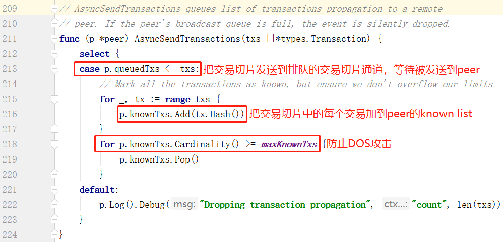

# 向相邻peers异步广播交易

## 广播交易入口

以太坊节点向相邻peers广播交易的流程是由eth.ProtocolManager触发的，eth.ProtocolManager是管理p2p通信的核心类，它也是eth.Ethereum的成员变量。

eth.ProtocolManager的启动方法是Start()，它被调用的地方只有一个，就是在eth.Ethereum的Start(srvr *p2p.Server)中被调用，见下图

ProtocolManager.Start()会启用4个单独goroutine去分别执行四个独立的业务流程。其中有一个goroutine就是用于向相邻peers广播交易的

	go pm.txBroadcastLoop()

见下图

首先创建一个通道pm.txsCh用来接收新交易的事件，通道pm.txsCh的缓冲区大小是4096，意味着事件发送方pm.txpool最大可以往通道pm.txsCh发送4096个事件，每个事件都可以包含多个交易；然后pm.txpool创建一个新交易事件的订阅，当有新交易的时候，pm.txpool（其实就是core.TxPool）把交易事件发送到通道pm.txsCh，也就是说，通道pm.txsCh是用于接收来自core.TxPool的新交易的事件。

然后通过txBroadcastLoop()方法来启动广播交易到相邻peers的goroutine，用于广播新出现的交易。

## txBroadcastLoop()方法的内部逻辑

txBroadcastLoop()会在pm.txsCh通道的收端持续等待，一旦接收到有关新交易的事件，会立即调用BroadcastTx()方法广播给那些尚无该交易对象的相邻个体。更具体一点就是，当前节点发送了交易，或者是接收到别人发来的交易信息的时候，txpool会产生一个事件，事件被传递到pm.txsCh通道，然后被goroutine txBroadcastLoop()处理, 通过BroadcastTxs()方法发送给相邻的不知道这个交易的peers。

## BroadcastTxs方法的内部逻辑

1. 对于交易事件中包含的每一个交易，检查本地保存的每个相邻peer是否知道这个交易，只有当peer不知道这个交易时，才把这个交易广播给这个peer，检查完所有的交易和peers之后，会形成一个map，key是peer，value是需要向这个peer广播的交易切片。

2. 对于每个peer，调用peer.AsyncSendTransactions()方法异步广播交易，注意，这里是异步广播，这个方法并不会直接把交易广播到peer，而是把交易切片添加到queuedTxs，这是用于向peer广播的交易切片队列，然后把交易切片中的所有交易哈希都标记为known，即被peer知道。注意一个细节，一个peer最大的known交易数即known list的size不能超过32768，这是为了防止DOS攻击。另外，queuedTxs的缓冲区大小是128.

3. peer.AsyncSendTransactions()方法把交易切片添加到queuedTxs之后，peer.broadcast()方法持续从queuedTxs中接收交易切片，然后用peer.SendTransactions()方法把交易切片中的每个交易通过p2p.Send()方法发送到这个peer，并且把交易哈希添加到这个peer的known list。

2019.9.10 by Corey Lin
