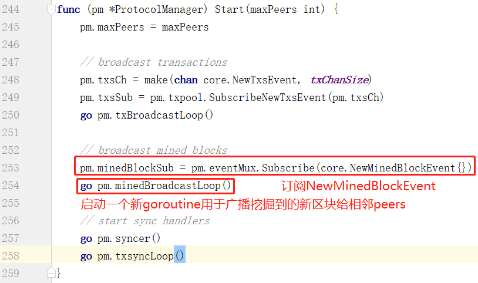
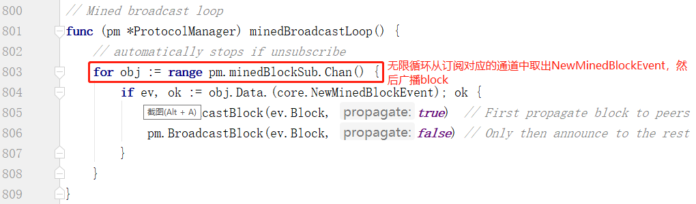
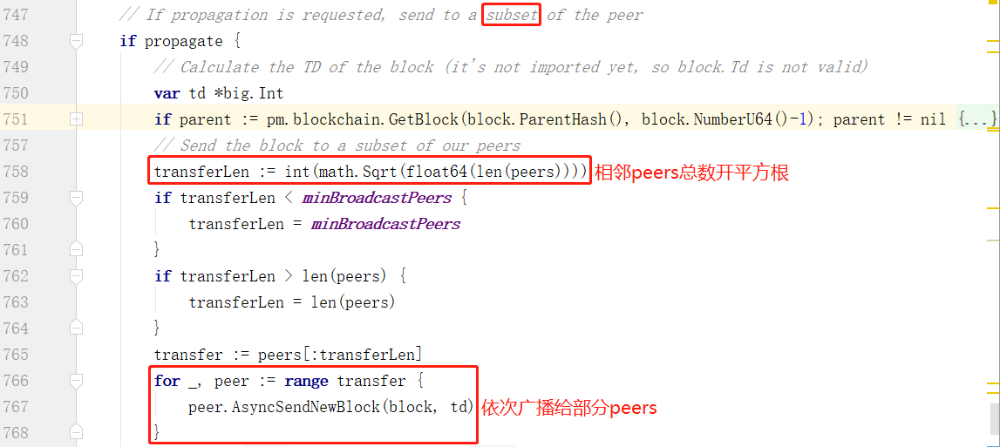
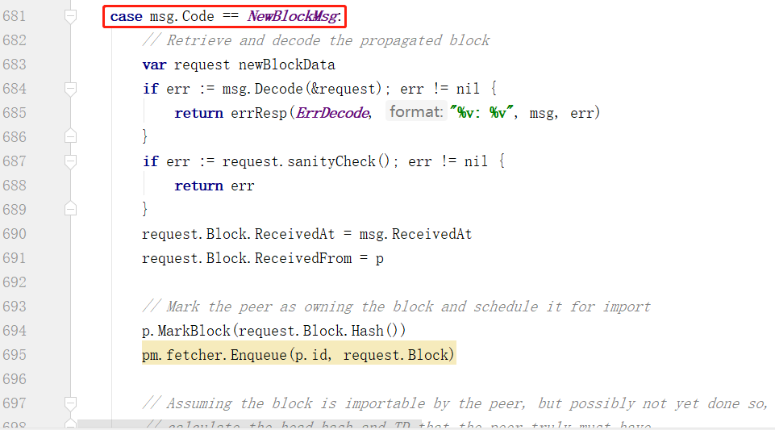
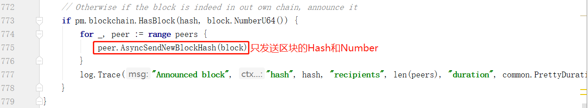
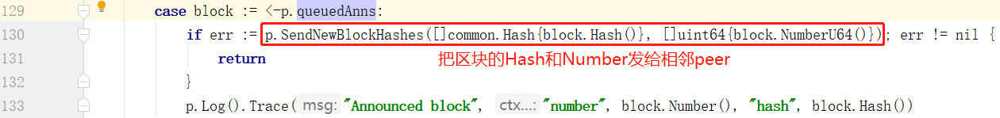
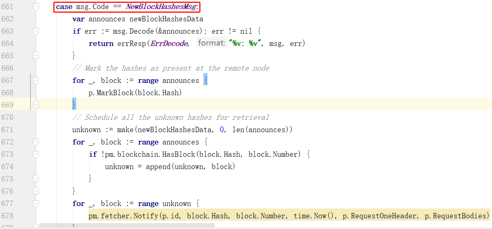

# 向相邻peers广播挖掘的区块

## 1.总流程

当一个节点挖掘出一个新区块之后，需要尽快地广播到网络上面去，也就是广播给自己的相邻peers。向相邻peers广播新挖掘出的区块是当前节点向相邻节点同步信息的一种方式，它由ProtocolManager.Start()方法启动一个新的goroutine触发。总流程有两步：

1. 订阅NewMinedBlockEvent

2. 无线循环把新区块广播给相邻peers

## 2.NewMinedBlockEvent的产生

首先是订阅NewMinedBlockEvent，当一个区块被导入时会产生一个NewMinedBlockEvent。说得更具体一点就是：当本节点打包一个新区块成功时，会Post一个NewMinedBlockEvent。

1. miner.worker.resultLoop()方法中，当收到本节点挖矿产生的一个新区块后通过WriteBlockWithState()把区块和所有相关状态写入本地leveldb数据库。

2. Post一个NewMinedBlockEvent，这个事件中包含这个block

## 3.无限循环把新区块广播给相邻peers

minedBroadcastLoop()持续等待本节点的新挖掘出的区块事件，然后立即广播相应区块给相邻peers。

1. 首先，用for循环不停地接收订阅对应的通道中的NewMinedBlockEvent，只要不取消订阅或者关闭订阅，那么订阅对应的通道都不会关闭，意味着是无限循环。

2. 在收到新挖掘出区块事件后，连续调用两次BroadcastBlock()，两次调用仅仅一个bool型参数propagate不一样，当该参数为true时，会将整个新区块依次发给相邻区块中的一小部分，具体个数就是相邻peers个数开平方根。这是通过peer.SendNewBlock()方法用p2p.Send把完整的新区块发送给部分相邻的peers。

远端peer会使用ProtocolManager.handleMsg()来处理收到的消息。当远端的peer收到一个完整新区块（NewBlockMsg）之后，会用如下逻辑处理这个消息（具体处理流程就不在这篇博客中讲了）：

而当propagate为false时，仅仅将新区块的Hash值和Number发送给所有相邻peers，这实际上是通知peers这个新区块已经可以获取了，相当于是对所有相邻peers宣布有一个新区块可以获取了。这是通过peer.SendNewBlockHashes()方法用p2p.Send把新区块的Hash值和Number发给相邻peers。

当远端的peer收到一个区块Hash值和Number（NewBlockHashesMsg）之后，会用如下逻辑处理这个消息（具体处理流程就不在这篇博客中讲了）：

注意：不管是使用AsyncSendNewBlock发送完整区块，还是使用AsyncSendNewBlockHash发送区块Hash和Number，本质上都是异步发送，把相应的区块信息写入通道（p.queuedProps和p.queuedAnns），然后由peer.broadcast()从通道中读出区块信息，然后发送给远端peer。

2019.9.12 by Corey Lin