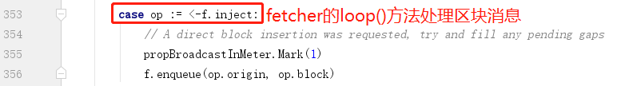

# 周期性和相邻peers同步

在ProtocolManager.Start()之后，会启动一个单独的goroutine用于周期性地和网络进行同步

	go pm.syncer()
	
这个goroutine在以下几种情况会主动和网络同步：

1. 接收到其他peer的announcement的时候进行同步

2. 新的peer连接的时候进行同步

3. 定时同步

## 1.接收到其他peer的announcement的时候进行同步

syncer()方法首先会启动pm.fetcher.Start()方法，也就是启动一个基于announcement的同步器，用于接收其他peer发送过来的通知，然后去其他peer上获取区块。

pm.fetcher.Start()实质上是调用了Fetcher的loop()方法，启动了一个无限循环，不停地检查并处理从其他peer来的各种通知事件。

主要是处理两种类型的通知事件

1. NewBlockHashesMsg

2. NewBlockMsg

pm.fetcher的逻辑这里就不细讲了，比较复杂，另外再写一篇博客来分析。

## 2.新的peer连接的时候进行同步

当有新的peer连接到当前节点，且新peer的数量大于等于5时，选择最优的peer发起一次全链同步。这里最优的概念是指peer中所维护区块链的TotalDifficulty(TD)最高，由于TD是全链中从创世区块到最新头块的Difficulty值总和，所以TD值最高就意味着它的区块链是最新的。

## 3.定时同步

除了和新连接的peer进行同步之外，还会定时、周期性地和最优peer进行同步

ProtocolManager.synchronise()的细节此处就不讲了。

另外，以太坊的源码中极大量地使用了goroutine和channel来处理并发，很有意思，充分发挥了golang的并发编程优势。

2019.9.16 by Corey Lin